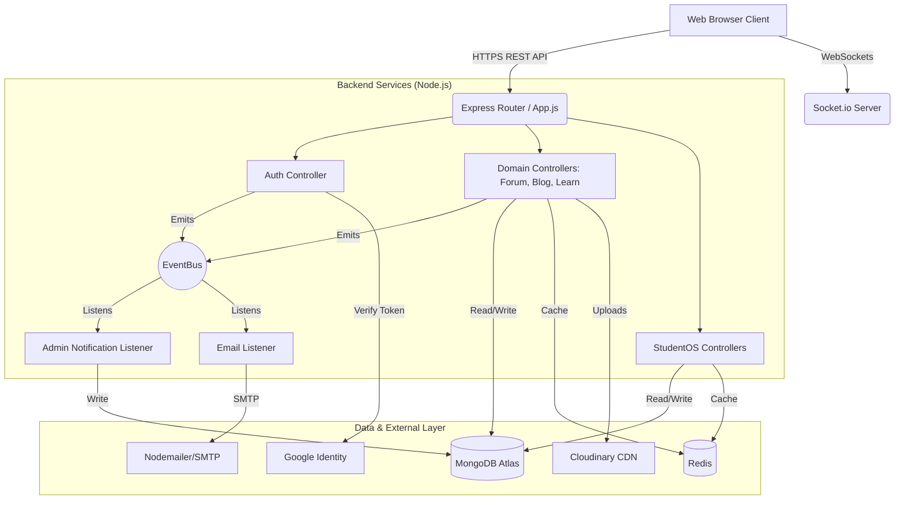
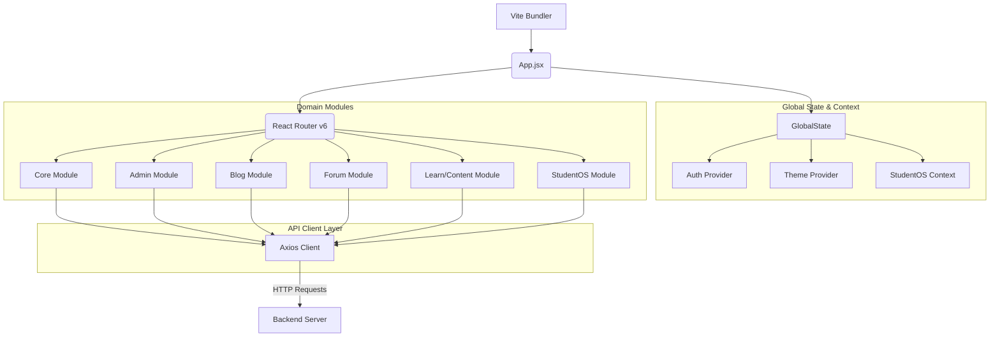
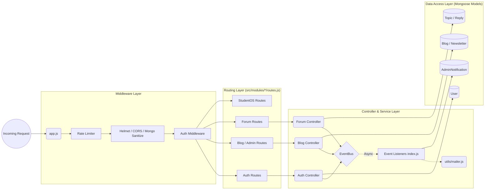

# System Architecture: HttpTechNex

Here is a high-level overview of the HttpTechNex platform's architecture. The application follows the modern decoupled client-server model, utilizing a React frontend and a Node.js/Express backend.

---

## 1. High-Level System Architecture

This diagram illustrates how the external client interacts with the backend services, the internal event bus, and external dependencies.

---

## 2. Frontend Architecture (React / Vite)

The frontend uses a highly modular structure. Instead of organizing purely by file type (e.g., all pages together, all components together), it is organized by **Domain Modules**, making it extremely scalable.

---

## 3. Backend Architecture (Node.js / Express)

The backend is built with Express and follows a clear separation of concerns: Routing -> Controller -> Data/Services. It incorporates Event-Driven Architecture (EDA) to prevent slow synchronous bottlenecks.

> [!TIP]
> **Why Event-Driven?** Notice how the Controllers offload secondary work (like sending emails or creating admin logs) to the **EventBus**. This ensures the primary HTTP request finishes instantly, dramatically improving the perceived speed for the end user.
